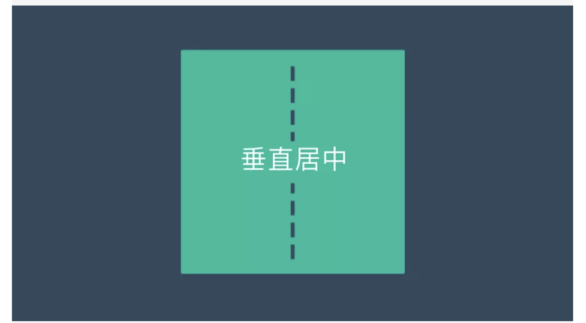
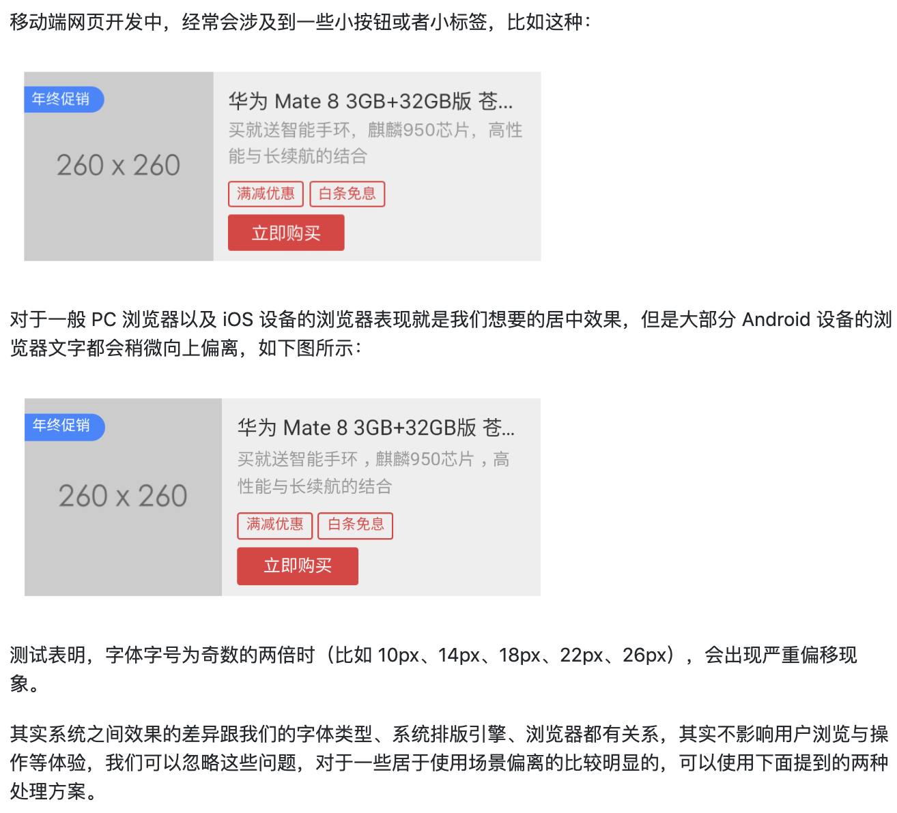
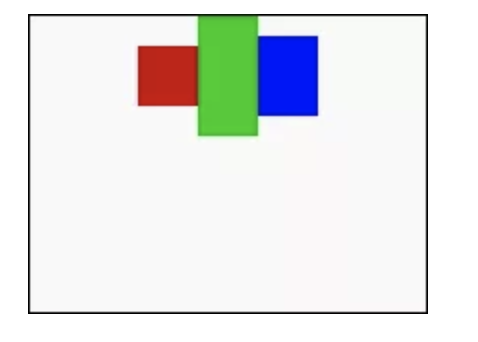
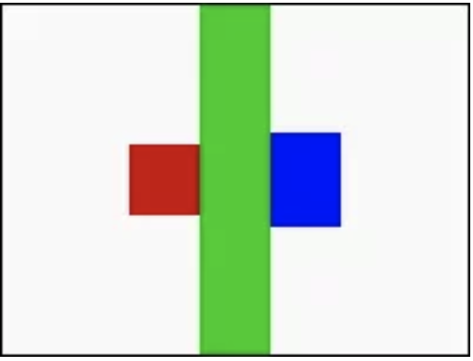
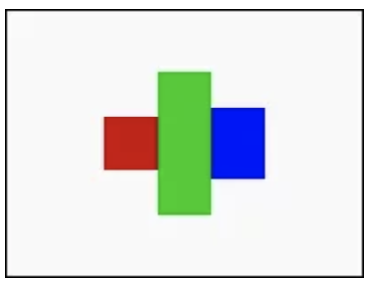
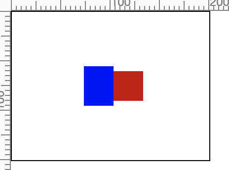
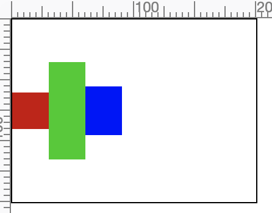
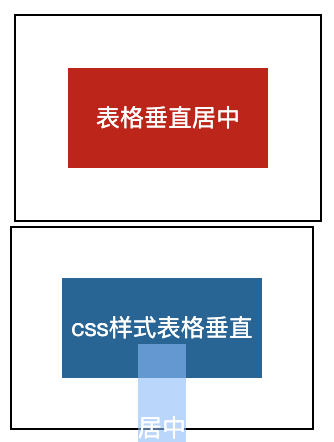
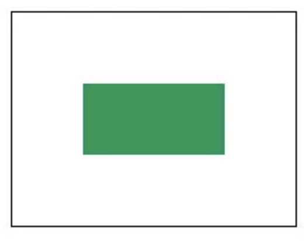
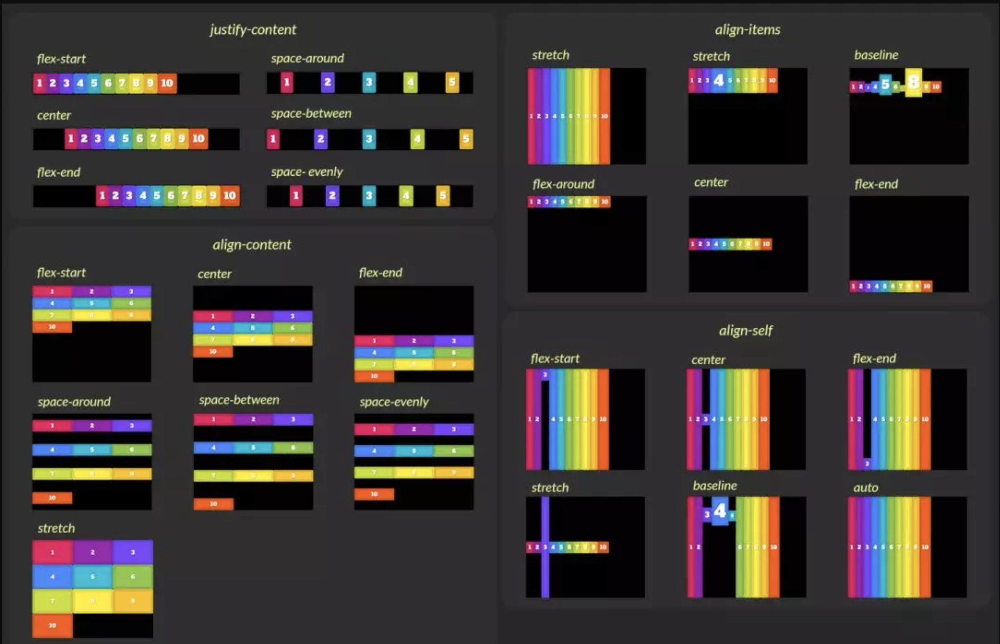

# CSS 垂直居中

我们在布局一个页面时，通常都会用到水平居中和垂直居中，处理水平居中很好处理，不外乎就是设定**margin:0 auto;**或是**text-align:center;**,就可以轻松解决掉水平居中的问题，以下将介绍单纯利用CSS垂直居中的方式



## 1. 设定行高( line-height )

设定行高是垂直居中最简单的方式，适用于「单行」的「行内元素」 ( inline、inline-block )，例如单行的标题，或是已经设为inline-block属性的div，若将line-height设成和高度一样的数值，则内容的行内元素就会被垂直置中，因为是行高，所以会在行内元素的上下都加上行高的1/2，所以就垂直置中了！不过由此就可以看出，为什么必须要单行的行内元素，因为如果多行，第二行与第一行的间距会变超大，就不是我们所期望的效果了。CSS范例：外层div0，内容redbox，让redbox水平垂直置中。

height line-height 实现居中时，有一个需要注意的地方



这个问题通过css是无法解决的，即使解决了也是一种通过微调来实现的hack方法，因为文字在content-area内部渲染的时候已经偏移了，而css的居中方案都是控制的整个content-area的居中。

导致这个问题的本质原因可能是Android在排版计算的时候参考了primyfont字体的相关属性（即HHead Ascent、HHead Descent等），而primyfont的查找是看`font-family`里哪个字体在fonts.xml里第一个匹配上，而原生Android下中文字体是没有family name的，导致匹配上的始终不是中文字体，所以解决这个问题就要在`font-family`里显式申明中文，或者通过什么方法保证所有字符都fallback到中文字体。根据这2个思路，目前我找到了2个解决方案：

1. 针对Android 7.0+设备：html标签上设置 lang 属性：html lang="zh-cmn-Hans"，同时font-family不指定英文，如 font-family: sans-serif 。这个方法是利用了浏览器的字体fallback机制，让英文也使用中文字体来展示，blink早期的内核在fallback机制上存在问题，Android 7.0+才能ok，早期的内核下会导致英文fallback到Noto Sans Myanmar，这个字体非常丑。
2. 针对MIUI 8.0+设备：设置 font-family: miui 。这个方案就是显式申明中文的方案，MIUI在8.0+上内置了小米兰亭，同时在fonts.xml里给这个字体指定了family name：miui，所以我们可以直接设置。

### 方案一

我们可以通过 transform: scale 来处理，比如，字体大小是 8px，我们把字体设定为 16px，然后通过 scale(0.5) 缩放至一倍大小，简单粗暴。

注意：放大两倍会使得容器被撑开占位。

### 方案二

结合行高、对齐的关系，结合伪元素得出的黑科技，亲测效果很理想。

```css
.jd::before {
    content: '';
    display: inline-block;
    vertical-align: middle;
    width: 0;
    height: 100%;
    margin-top: 1px;
}
```

## 2. 添加伪元素( ::before、::after )

伪元素的方式可以设置多行的元素垂直居中，这个属性虽然是垂直置中，不过却是指在元素内的所有元素垂直位置互相置中。



```css
.div0{
    width:200px;
    height:150px;
    border:1px solid #000;
    text-align:center;
}
.redbox{
    width:30px;
    height:30px;
    background:#c00;
    display:inline-block;
    vertical-align:middle;
}
.greenbox{
    width:30px;
    height:60px;
    background:#0c0;
    display:inline-block;
    vertical-align:middle;
}
.bluebox{
    width:30px;
    height:40px;
    background:#00f;
    display:inline-block;
    vertical-align:middle;
}
```

如果有一个方块变成了高度100%，那么其他的方块就会真正的垂直居中。



```css
.greenbox{
    width:30px;
    height:100%;
    background:#0c0;
    display:inline-block;
    vertical-align:middle;
}
```



但是总不能每次要垂直居中，都要添加一个奇怪的div！解决办法就是利用::before和::after添加div进到框框内，让这个「伪」div的高度100%,就可以轻松地让其他的div都居中。

**div记得要把display设为inline-block，毕竟 vertical-align:middle 是针对行内元素，div本身是block，所以必须要做更改！**



## 3. calc 动态计算

在某种场景，或为了html更加语义化，或符合html规范，必须使用block元素。

可以利用CSS特有的calc动态计算

只要让要居中的div的top属性，与上方的距离是「50%的外框高度- 50%的div高度」，就可以做到垂直居中，因为margin抓到的是水平高度，所以不用margin-top，必须要用top才会正确。



缺陷：

+ 必须已知居中元素自身高度。
+ 如要水平居中，则必须已知外容器宽度。

## 4. 使用表格或模拟表格

在表格中，实现垂直居中非常容易只需要vertical-align:middle，这利用了容器元素display：table，子元素table-cell的特性，利用了table的渲染特性。



缺陷:

+ 细节布局会受表格 table 影响，需要额外样式实现，完善细节

## 5. transform

transform是CSS3的新属性，用于元素的变形、旋转和位移，利用transform里头的translateY，配元素本身相对定位以及top属性，实现垂直居中。
**子元素必须要加上position:relative**

```css
.use-transform{
    width:200px;
    height:200px;
    border:1px solid #000;
}
.use-transform div{
    position: relative;
    width:100px;
    height:50px;
    top:50%;
    transform:translateY(-50%);
    background:#095;
}
```

关于Transforms的用法[《Transforms 属性在实际项目中如何应用？》](http://mp.weixin.qq.com/s?__biz=MjM5MjU2NDk0Nw==&mid=2247484238&idx=1&sn=a25bc1b0f1ef47fdae84715da94f63a2&chksm=a6a510f291d299e47be6d6f7d8839c1ec34ae51be42aceedc95f43011afce699a5925523b405&scene=21#wechat_redirect)



## 6. 绝对定位

position:absolute，利用绝对定位来指定，但垂直置中的做法又和我们正统的绝对位置不太相同，是要将上下左右的数值都设为0，再搭配一个margin:auto，就可以办到垂直置中，不过要特别注意的是，设定绝对定位的子元素，其父元素的position必须要指定为relative！而且绝对定位的元素是会互相覆盖的，所以如果内容元素较多，就会有互相遮盖以及zindex层级问题。

缺陷:

+ 只适合单一元素居中的场景

## 7. Flexbox

使用align-items或align-content的属性


