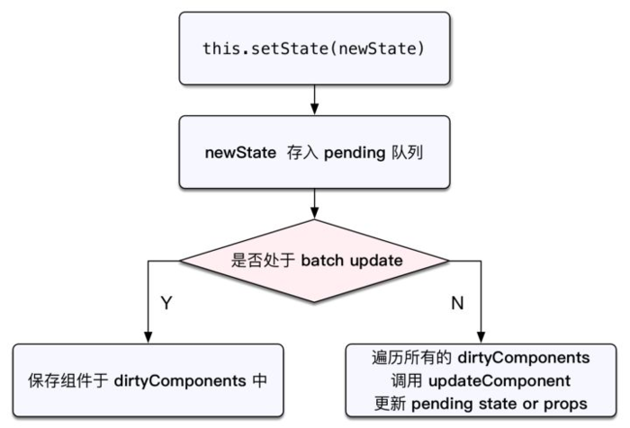
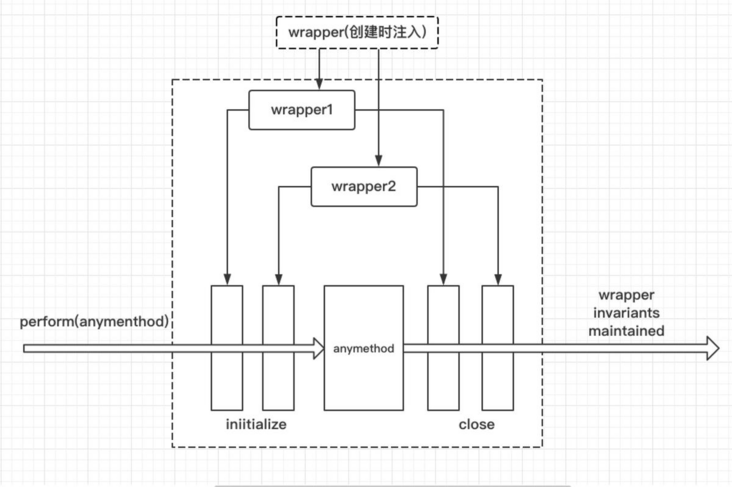
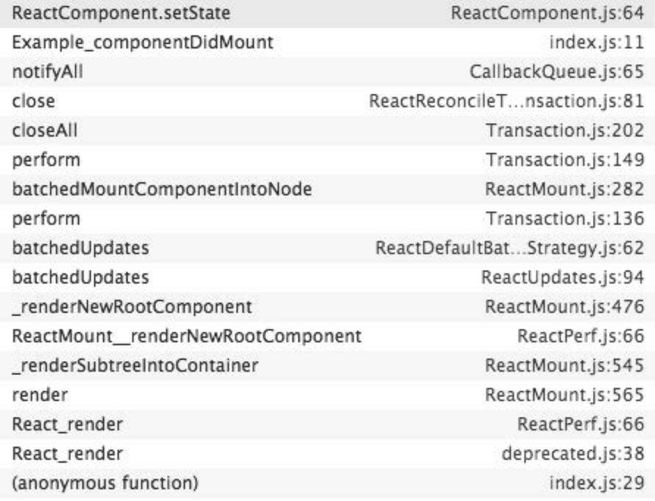
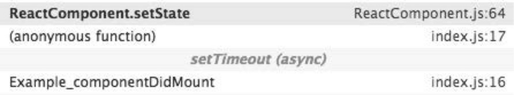

# React setState 总结

假如有这样一个点击执行累加场景：

```js
this.state = {
  count: 0，
}

incrementCount() {
  this.setState({
    count: this.state.count + 1,
  });
}

handleIncrement = () => {
 this.incrementCount();
 this.incrementCount();
 this.incrementCount();
}
```

每一次点击， 累加三次，看一下输入：

并没有达到预期的效果，纠正也很简单：

```js
incrementCount() {
  this.setState((prevState) => {
    return {count: prevState.count + 1}
  });
}
```

再看输出：

setState 的时候， 一个传入了object, 一个传入了更新函数。

区别在于： 传入一个更新函数，就可以访问当前状态值。 setState调用是 批量处理的，因此可以让更新建立在彼此之上，避免冲突。

那问题来了， 为什么前一种方式就不行呢？ 带着这个疑问，继续往下看。

setState 为什么不会同步更新组件？

进入这个问题之前，我们先回顾一下现在对 setState 的认知：

1. setState 不会立刻改变React组件中state的值.
2. setState 通过触发一次组件的更新来引发重绘.
3. 多次 setState 函数调用产生的效果会合并。

重绘会引起React的更新生命周期4个函数：

* shouldComponentUpdate（被调用时this.state没有更新；如果返回了false，生命周期被中断，虽然不调用之后的函数了，但是state仍然会被更新）
* componentWillUpdate（被调用时this.state没有更新）
* render（被调用时this.state得到更新）
* componentDidUpdate

如果每一次 setState 调用都走一圈生命周期，光是想一想也会觉得会带来性能的问题，其实这四个函数都是纯函数，性能应该还好，但是render函数返回的结果会拿去做Virtual DOM比较和更新DOM树，这个就比较费时间。

目前React会将setState的效果放在队列中，积攒着一次引发更新过程。

为的就是把 Virtual DOM 和 DOM 树操作降到最小，用于提高性能。

某些操作是可以同步更新this.state的。

setState 什么时候会执行同步更新？

在React中，如果是由React引发的事件处理（比如通过onClick引发的事件处理），调用 setState 不会同步更新 this.state，除此之外的setState调用会同步执行this.state。

> 我自己简单概括就是:不是由React框架调度的时候，同步执行，由React调度时，是异步执行的。<br/>
> 比如addEventListener绑定的事件/setTimeout/setInterval/Promise then catch，是同步

## setState大概原理

在React的setState函数实现中，会根据一个变量 isBatchingUpdates 判断是直接更新 this.state 还是放到队列中。

而isBatchingUpdates 默认是false，也就表示setState会同步更新this.state，但是有一个函数batchedUpdates。

这个函数会把isBatchingUpdates修改为true，而当React在调用事件处理函数之前就会调用这个batchedUpdates，造成的后果，就是由React控制的事件处理过程setState不会同步更新this.state



## 探秘setState 源码

```js
// setState方法入口如下:
ReactComponent.prototype.setState = function (partialState, callback) {
  // 将setState事务放入队列中
  this.updater.enqueueSetState(this, partialState);
  if (callback) {
    this.updater.enqueueCallback(this, callback, 'setState');
}};
```

相关的几个概念：

* `partialState`，有部分state的含义，可见只是影响涉及到的state，不会伤及无辜。
* `enqueueSetState` 是 state 队列管理的入口方法，比较重要，我们之后再接着分析。

* `replaceState`:

  ```js
  replaceState: function (newState, callback) {
    this.updater.enqueueReplaceState(this, newState);
    if (callback) {
      this.updater.enqueueCallback(this, callback, 'replaceState');
    }},
  ```

  `replaceState`中取名为newState，有完全替换的含义。同样也是以队列的形式来管理的。

* `enqueueSetState`:

  ```js
  enqueueSetState: function (publicInstance, partialState) {
    // 先获取ReactComponent组件对象
    var internalInstance = getInternalInstanceReadyForUpdate(publicInstance, 'setState');

    if (!internalInstance) {
      return;
    }

    // 如果_pendingStateQueue为空,则创建它。可以发现队列是数组形式实现的
    var queue = internalInstance._pendingStateQueue || (internalInstance._pendingStateQueue = []);
    queue.push(partialState);

    // 将要更新的ReactComponent放入数组中
    enqueueUpdate(internalInstance);}
  ```

    其中getInternalInstanceReadyForUpdate源码如下

    ```js
    function getInternalInstanceReadyForUpdate(publicInstance, callerName) {
      // 从map取出ReactComponent组件,还记得mountComponent时把ReactElement作为key，将ReactComponent存入了map中了吧，ReactComponent是React组件的核心，包含各种状态，数据和操作方法。而ReactElement则仅仅是一个数据类。
      var internalInstance = ReactInstanceMap.get(publicInstance);
      if (!internalInstance) {
        return null;
      }

      return internalInstance;
    }
    ```

    enqueueUpdate源码如下:

    ```js
    function enqueueUpdate(component) {
      ensureInjected();

      // 如果不是正处于创建或更新组件阶段,则处理update事务
      if (!batchingStrategy.isBatchingUpdates) {
        batchingStrategy.batchedUpdates(enqueueUpdate, component);
        return;
      }

      // 如果正在创建或更新组件,则暂且先不处理update,只是将组件放在dirtyComponents数组中
      dirtyComponents.push(component);
    }
    ```

    batchedUpdates

    ```js
    batchedUpdates: function (callback, a, b, c, d, e) {
      var alreadyBatchingUpdates = ReactDefaultBatchingStrategy.isBatchingUpdates;
      // 批处理最开始时，将isBatchingUpdates设为true，表明正在更新
      ReactDefaultBatchingStrategy.isBatchingUpdates = true;

      // The code is written this way to avoid extra allocations
      if (alreadyBatchingUpdates) {
        callback(a, b, c, d, e);
      } else {
        // 以事务的方式处理updates，后面详细分析transaction
        transaction.perform(callback, null, a, b, c, d, e);
      }
    }

    var RESET_BATCHED_UPDATES = {
      initialize: emptyFunction,
      close: function () {
        // 事务批更新处理结束时，将isBatchingUpdates设为了false
      ReactDefaultBatchingStrategy.isBatchingUpdates = false;
    }};
    var TRANSACTION_WRAPPERS = [FLUSH_BATCHED_UPDATES, RESET_BATCHED_UPDATES];
    ```

    enqueueUpdate包含了React避免重复render的逻辑。

    mountComponent 和 updateComponent 方法在执行的最开始，会调用到 batchedUpdates 进行批处理更新，此时会将isBatchingUpdates设置为true，也就是将状态标记为现在正处于更新阶段了。

    之后React以事务的方式处理组件update，事务处理完后会调用wrapper.close() 。

    而TRANSACTION_WRAPPERS 中包含了RESET_BATCHED_UPDATES 这个wrapper，故最终会调用RESET_BATCHED_UPDATES.close(), 它最终会将isBatchingUpdates设置为false。

    故 getInitialState，componentWillMount， render，componentWillUpdate 中 setState 都不会引起 updateComponent。 ???

    但在componentDidMount 和 componentDidUpdate中则会。???

## 事务

事务通过`wrapper`进行封装。



一个wrapper包含一对 initialize 和 close 方法。比如 RESET_BATCHED_UPDATES：

```js
var RESET_BATCHED_UPDATES = {
  // 初始化调用
  initialize: emptyFunction,
  // 事务执行完成，close时调用
  close: function () {
    ReactDefaultBatchingStrategy.isBatchingUpdates = false;
  }
};
```

`transaction`被包装在wrapper中，比如:

```js
var TRANSACTION_WRAPPERS = [FLUSH_BATCHED_UPDATES, RESET_BATCHED_UPDATES];
```

`transaction`是通过`transaction.perform(callback, args…)`中的`initialize`方法，然后执行`perform`方法中的`callback`，最后再执行`close`方法。

下面分析`transaction.perform(callback, args…)`

```js
  perform: function (method, scope, a, b, c, d, e, f) {
    var errorThrown;
    var ret;
    try {
      this._isInTransaction = true;
      errorThrown = true;
      // 先运行所有wrapper中的initialize方法
      this.initializeAll(0);

      // 再执行perform方法传入的callback
      ret = method.call(scope, a, b, c, d, e, f);
      errorThrown = false;
    } finally {
      try {
        if (errorThrown) {
          // 最后运行wrapper中的close方法
          try {
            this.closeAll(0);
          } catch (err) {}
        } else {
          // 最后运行wrapper中的close方法
          this.closeAll(0);
        }
      } finally {
        this._isInTransaction = false;
      }
    }
    return ret;
  },

  initializeAll: function (startIndex) {
    var transactionWrappers = this.transactionWrappers;
    // 遍历所有注册的wrapper
    for (var i = startIndex; i < transactionWrappers.length; i++) {
      var wrapper = transactionWrappers[i];
      try {
        this.wrapperInitData[i] = Transaction.OBSERVED_ERROR;
        // 调用wrapper的initialize方法
        this.wrapperInitData[i] = wrapper.initialize ? wrapper.initialize.call(this) : null;
      } finally {
        if (this.wrapperInitData[i] === Transaction.OBSERVED_ERROR) {
          try {
            this.initializeAll(i + 1);
          } catch (err) {}
        }
      }
    }
  },

  closeAll: function (startIndex) {
    var transactionWrappers = this.transactionWrappers;
    // 遍历所有wrapper
    for (var i = startIndex; i < transactionWrappers.length; i++) {
      var wrapper = transactionWrappers[i];
      var initData = this.wrapperInitData[i];
      var errorThrown;
      try {
        errorThrown = true;
        if (initData !== Transaction.OBSERVED_ERROR && wrapper.close) {
          // 调用wrapper的close方法，如果有的话
          wrapper.close.call(this, initData);
        }
        errorThrown = false;
      } finally {
        if (errorThrown) {
          try {
            this.closeAll(i + 1);
          } catch (e) {}
        }
      }
    }
    this.wrapperInitData.length = 0;
  }
```

更新组件： `runBatchedUpdates`

前面分析到`enqueueUpdate`中调用`transaction.perform(callback, args...)`后，发现，`callback`还是`enqueueUpdate`方法啊，那岂不是死循环了？不是说好的`setState`会调用`updateComponent`，从而自动刷新View的吗？ 我们还是要先从`transaction`事务说起。

我们的wrapper中注册了两个wrapper，如下：

```js
var TRANSACTION_WRAPPERS = [FLUSH_BATCHED_UPDATES, RESET_BATCHED_UPDATES];
```

`RESET_BATCHED_UPDATES`用来管理`isBatchingUpdates`状态，我们前面在分析`setState`是否立即生效时已经讲解过了。

那`FLUSH_BATCHED_UPDATES`用来干嘛呢？

```js
var FLUSH_BATCHED_UPDATES = {
  initialize: emptyFunction,
  close: ReactUpdates.flushBatchedUpdates.bind(ReactUpdates)
};
var flushBatchedUpdates = function () {
  // 循环遍历处理完所有dirtyComponents
  while (dirtyComponents.length || asapEnqueued) {
    if (dirtyComponents.length) {
      var transaction = ReactUpdatesFlushTransaction.getPooled();
      // close前执行完runBatchedUpdates方法，这是关键
      transaction.perform(runBatchedUpdates, null, transaction);
      ReactUpdatesFlushTransaction.release(transaction);
    }

    if (asapEnqueued) {
      asapEnqueued = false;
      var queue = asapCallbackQueue;
      asapCallbackQueue = CallbackQueue.getPooled();
      queue.notifyAll();
      CallbackQueue.release(queue);
    }
  }
};

```

`FLUSH_BATCHED_UPDATES`会在一个`transaction`的`close`阶段运行`runBatchedUpdates`，从而执行`update`。

```js
function runBatchedUpdates(transaction) {
  var len = transaction.dirtyComponentsLength;
  dirtyComponents.sort(mountOrderComparator);

  for (var i = 0; i < len; i++) {
    // dirtyComponents中取出一个component
    var component = dirtyComponents[i];

    // 取出dirtyComponent中的未执行的callback,下面就准备执行它了
    var callbacks = component._pendingCallbacks;
    component._pendingCallbacks = null;

    var markerName;
    if (ReactFeatureFlags.logTopLevelRenders) {
      var namedComponent = component;
      if (component._currentElement.props === component._renderedComponent._currentElement) {
        namedComponent = component._renderedComponent;
      }
    }
    // 执行updateComponent
    ReactReconciler.performUpdateIfNecessary(component, transaction.reconcileTransaction);

    // 执行dirtyComponent中之前未执行的callback
    if (callbacks) {
      for (var j = 0; j < callbacks.length; j++) {
        transaction.callbackQueue.enqueue(callbacks[j], component.getPublicInstance());
      }
    }
  }
}
```

`runBatchedUpdates`循环遍历`dirtyComponents`数组，主要干两件事。

1. 首先执行performUpdateIfNecessary来刷新组件的view
2. 执行之前阻塞的callback。

```js
performUpdateIfNecessary: function (transaction) {
  if (this._pendingElement != null) {
    // receiveComponent会最终调用到updateComponent，从而刷新View
    ReactReconciler.receiveComponent(this, this._pendingElement, transaction, this._context);
  }

  if (this._pendingStateQueue !== null || this._pendingForceUpdate) {
    // 执行updateComponent，从而刷新View。这个流程在React生命周期中讲解过
    this.updateComponent(transaction, this._currentElement, this._currentElement, this._context, this._context);
  }
},
```

最后惊喜的看到了receiveComponent和updateComponent吧。

receiveComponent最后会调用updateComponent，而updateComponent中会执行React组件存在期的生命周期方法，

如componentWillReceiveProps， shouldComponentUpdate， componentWillUpdate，render, componentDidUpdate。

从而完成组件更新的整套流程。

## 整体流程回顾：

1. enqueueSetState将state放入队列中，并调用enqueueUpdate处理要更新的Component
2. 如果组件当前正处于update事务中，则先将Component存入dirtyComponent中。否则调用batchedUpdates处理。
3. batchedUpdates发起一次transaction.perform()事务
4. 开始执行事务初始化，运行，结束三个阶段
5. 初始化：事务初始化阶段没有注册方法，故无方法要执行
6. 运行：执行setSate时传入的callback方法，一般不会传callback参数
7. 结束：更新isBatchingUpdates为false，并执行FLUSH_BATCHED_UPDATES这个wrapper中的close方法
8. FLUSH_BATCHED_UPDATES在close阶段，会循环遍历所有的dirtyComponents，调用updateComponent刷新组件，并执行它的pendingCallbacks, 也就是setState中设置的callback。

看完理论， 我们再用一个例子巩固下.

## 再看一个例子

```jsx
class Example extends React.Component {
  constructor() {
    super();
    this.state = {
      val: 0
    };
  }
  componentDidMount() {
    this.setState({val: this.state.val + 1});
    console.log('第 1 次 log:', this.state.val);
    this.setState({val: this.state.val + 1});
    console.log('第 2 次 log:', this.state.val);

  setTimeout(() => {
    this.setState({val: this.state.val + 1});
    console.log('第 3 次 log:', this.state.val);
    this.setState({val: this.state.val + 1});
    console.log('第 4 次 log:', this.state.val);
  }, 0);
  }
  render() {
    return null;
  }
};
```

前两次在isBatchingUpdates 中，没有更新state, 输出两个0。

后面两次会同步更新， 分别输出2， 3；

很显然，我们可以将4次setState简单规成两类：

1. componentDidMount是一类
2.setTimeOut中的又是一类，因为这两次在不同的调用栈中执行。

我们先看看在componentDidMount中setState的调用栈：



再看看在setTimeOut中的调用栈：



我们重点看看在componentDidMount中的调用栈 ：
发现了`batchedUpdates`方法。

原来在setState调用之前，就已经处于`batchedUpdates`执行的事务之中了。

那`batchedUpdates`方法是谁调用的呢？我们再往上追溯一层，原来是ReactMount.js中的`_renderNewRootComponent`方法。

也就是说，整个将React组件渲染到DOM的过程就处于一个大的事务中了。

接下来就很容易理解了: 因为在`componentDidMount`中调用`setState`时，`batchingStrategy`的`isBatchingUpdates`已经被设置为true，所以两次`setState`的结果并没有立即生效，而是被放进了`dirtyComponents`中。

这也解释了两次打印`this.state.val`都是0的原因，因为新的`state`还没被应用到组件中。

再看setTimeOut中的两次`setState`，因为没有前置的`batchedUpdate`调用，所以`batchingStrategy`的`isBatchingUpdates`标志位是`false`，也就导致了新的`state`马上生效，没有走到`dirtyComponents`分支。

也就是说，`setTimeOut`中的第一次执行，`setState`时，`this.state.val`为1;

而`setState`完成后打印时`this.state.val`变成了2。

第二次的setState同理。

通过上面的例子，我们就知道setState 是可以同步更新的，但是还是尽量避免直接使用， 仅作了解就可以了。

如果你非要玩一些骚操作，写出这样的代码去直接去操作this.state：

引用： <https://segmentfault.com/a/1190000015463599>

扩展阅读

<https://reactjs.org/docs/faq-state.html#what-does-setstate-do>

<https://reactjs.org/docs/react-component.html#setstate>

<https://zhuanlan.zhihu.com/p/26069727>

<https://zhuanlan.zhihu.com/p/25990883>

<https://medium.com/@wisecobbler/using-a-function-in-setstate-instead-of-an-object-1f5cfd6e55d1>

<https://zhuanlan.zhihu.com/p/28491123>