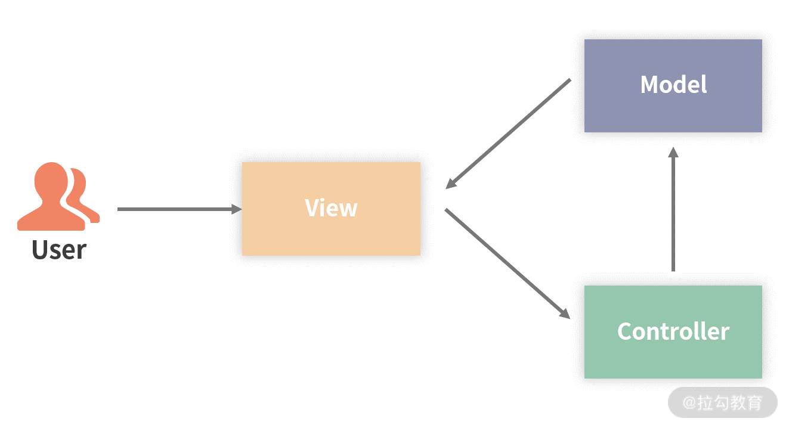
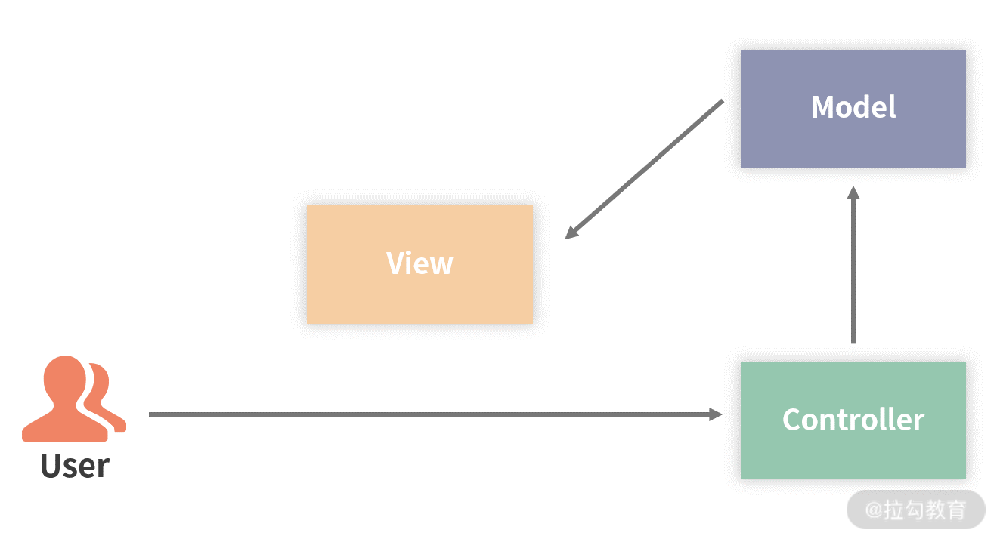
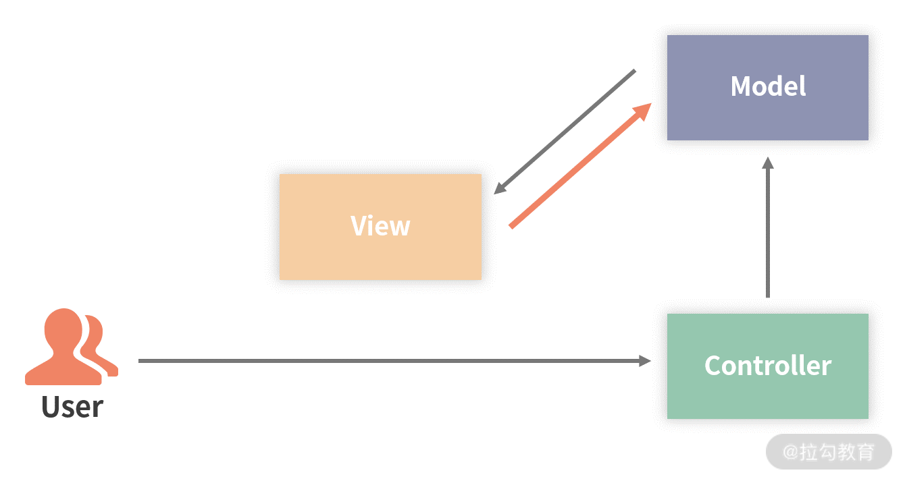
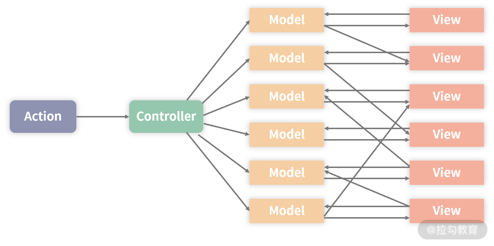
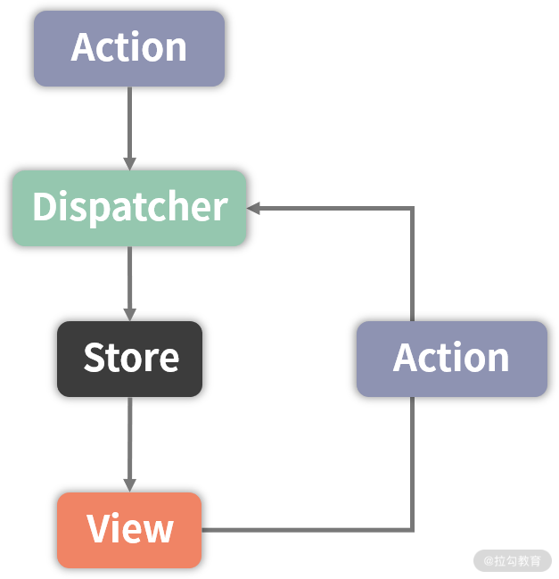
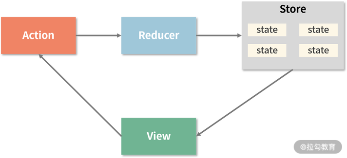
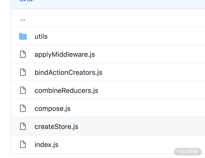
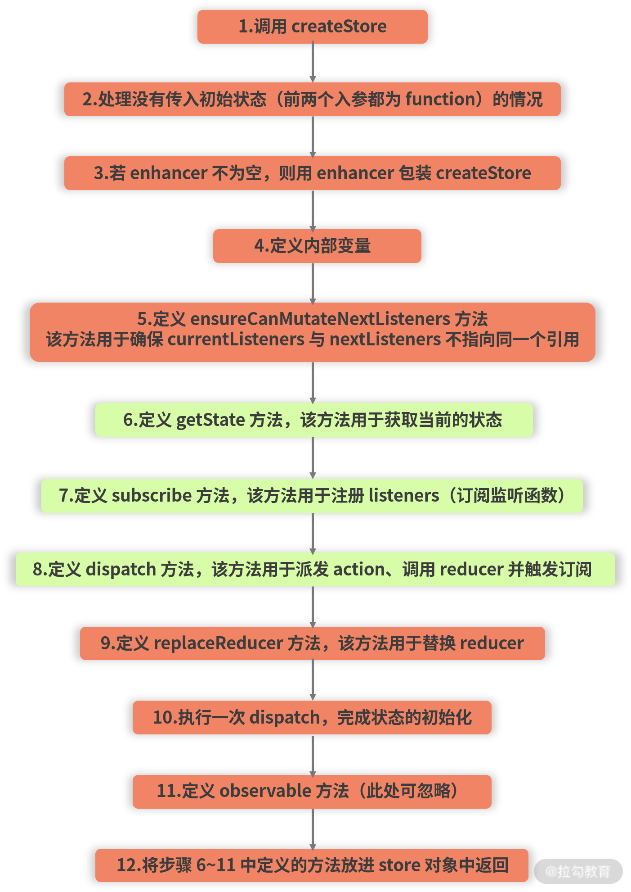

# 18 | 揭秘 Redux 设计思想与工作原理（上）

Redux 相信大家或多或少都接触过，关于 Redux 的基础知识，第 05 讲已经有过铺垫。从本讲开始，我们将在此基础上，针对 Redux 进行更加系统和深入的学习。

> 注：如果你没有接触过 Redux，点击[这里](https://www.redux.org.cn/)可以快速上手。

**何谓“系统”的学习**？系统的一个前提就是**建立必要的学习上下文**，尝试理解事情的来龙去脉。

这些年不管是面试、还是帮读者答疑，我有一个很强烈的感受：很多人对 Redux 的基本操作很熟悉，甚至对它的运作机制也有所了解，但就是不明白为什么要用 Redux，更不清楚 Redux 到底解决了什么问题。因此在讲源码和原理之前，我们首先需要说清楚的是 Redux 的问题背景和架构思想。

## Redux 背后的架构思想——认识 Flux 架构

Redux 的设计在很大程度上受益于 Flux 架构，我们可以认为 Redux 是 Flux 的一种实现形式（虽然它并不严格遵循 Flux 的设定），理解 Flux 将帮助你更好地从抽象层面把握 Redux。

Flux 并不是一个具体的框架，它是一套由 Facebook 技术团队提出的应用架构，这套架构约束的是**应用处理数据的模式**。在 Flux 架构中，一个应用将被拆分为以下 4 个部分。

* **View（视图层）**：用户界面。该用户界面可以是以任何形式实现出来的，React 组件是一种形式，Vue、Angular 也完全 OK。**Flux 架构与 React 之间并不存在耦合关系**。
* **Action（动作）**：也可以理解为视图层发出的“消息”，它会触发应用状态的改变。
* **Dispatcher（派发器）**：它负责对 action 进行分发。
* **Store（数据层）**：它是存储应用状态的“仓库”，此外还会定义修改状态的逻辑。store 的变化最终会映射到 view 层上去。

这 4 个部分之间的协作将通过下图所示的工作流规则来完成配合：


一个典型的 Flux 工作流是这样的：用户与 View 之间产生交互，通过 View 发起一个 Action；Dispatcher 会把这个 Action 派发给 Store，通知 Store 进行相应的状态更新。Store 状态更新完成后，会进一步通知 View 去更新界面。

> 值得注意的是，图中所有的箭头都是单向的，这也正是 Flux 架构最核心的一个特点——**单向数据流**。

那么 Flux 架构的出现到底是为了解决什么问题呢？

## Flux 架构到底解决了什么问题

Flux 的核心特征是单向数据流，要想完全了解单向数据流的好处，我们需要先了解双向数据流带来了什么问题。

### MVC 模式在前端场景下的局限性

双向数据流最为典型的代表就是**前端场景下的 MVC 架构**，该架构的示意图如下图所示：



除了允许用户通过 View 层交互来触发流程以外，MVC 架构还有另外一种形式，即允许用户通过直接触发 Controller 逻辑来触发流程，这种模式下的架构关系如下图所示：



在 MVC 应用中，会涉及这 3 个部分：

* Model（模型），程序需要操作的数据或信息；
* View（视图），用户界面；
* Controller（控制器），用于连接 View 和 Model，管理 Model 与 View 之间的逻辑。

原则上来说，三者的关系应该像上图一样，用户操作 View 后，由 Controller 来处理逻辑（或者直接触发 Controller 的逻辑），经过 Controller 将改变应用到 Model 中，最终再反馈到 View 上。在这个过程中，数据流应该是单向的。

**事实上，在许多服务端的 MVC 应用中，数据流确实能够保持单向。但是在前端场景下，实际的 MVC 应用要复杂不少，前端应用/框架往往出于交互的需要，允许 View 和 Model 直接通信**。此时的架构关系就会变成下图这样：



这就允许了双向数据流的存在。当业务复杂度较高时，数据流会变得非常混乱，出现类似下图这种情况：



图中我们的示例只有一个 Controller，但考虑到一个应用中还可能存在多个 Controller，实际的情况应该比上图还要复杂得多（尽管图示本身已经够复杂了）。

在如此复杂的依赖关系下，再小的项目变更也将伴随着不容小觑的风险——或许一个小小的改动，就会对整个项目造成“蝴蝶效应”般的巨大影响。如此混乱的修改来源，将会使得我们连 Bug 排查都无从下手，因为你很难区分出一个数据的变化到底是由哪个 Controller 或者哪个 View 引发的。

此时再回头看下 Flux 的架构模式，你应该多少能感受到其中的妙处。这里我们再来回顾一下 Flux 中的数据流模式，请看下图：



Flux 最核心的地方在于**严格的单向数据流**，在单向数据流下，**状态的变化是可预测的**。如果 store 中的数据发生了变化，那么有且仅有一个原因，那就是由 Dispatcher 派发 Action 来触发的。这样一来，就从根本上避免了混乱的数据关系，使整个流程变得清晰简单。

不过这并不意味着 Flux 是完美的。事实上，Flux 对数据流的约束背后是不可忽视的成本：除了开发者的学习成本会提升外，Flux 架构还意味着项目中代码量的增加。

Flux 架构往往在复杂的项目中才会体现出它的优势和必要性。如果项目中的数据关系并不复杂，其实完全轮不到 Flux 登场，这一点对于 Redux 来说也是一样的。

现在你不妨结合 Flux 架构的特性，再去品味一遍 Redux 官方给出的这个定义：

> Redux 是 JavaScript 状态容器，它提供可预测的状态管理。

此时的你，想必更加能够体会“可预测”这三个字背后的深意。

## Redux 关键要素与工作流回顾

Redux 库和 Flux 架构之间可以说是“你侬我侬”，虽然 Redux 在实现层面并没有按照 Flux 那一套来（比如 Flux 中允许多个 Store 存在，而 Redux 中只有一个 Store 等），但 Redux 在设计思想上确实和 Flux 一脉相承。

前面我们介绍的 Flux 架构的特征、解决问题的思路，包括使用场景方面的注意事项，完全可以迁移到 Redux 上来用。基于 Flux 的思想背景去理解 Redux 这个落地产物，你的学习曲线将会更加平滑一些。

接下来我们在介绍 Redux 的实现原理之前，先简单回顾一下它的关键要素与工作流。Redux 主要由 3 部分组成：Store、Reducer 和 Action。

* Store：它是一个单一的数据源，而且是只读的。
* Action 人如其名，是“动作”的意思，它是对变化的描述。
* Reducer 是一个函数，它负责**对变化进行分发和处理**，最终将新的数据返回给 Store。

Store、Action 和 Reducer 三者紧密配合，便形成了 Redux 独树一帜的工作流，如下图所示：



在 Redux 的整个工作过程中，**数据流是严格单向的**。如果你想对数据进行修改，只有一种途径：派发 Action。Action 会被 Reducer 读取，Reducer 将根据 Action 内容的不同执行不同的计算逻辑，最终生成新的 state（状态），这个新的 state 会更新到 Store 对象里，进而驱动视图层面作出对应的改变。

对于组件来说，任何组件都可以以约定的方式从 Store 读取到全局的状态，任何组件也都可以通过合理地派发 Action 来修改全局的状态。**Redux 通过提供一个统一的状态容器**，使得数据能够自由而有序地在任意组件之间穿梭。

复习完 Redux 的工作流，下面我们来结合源码看看这套工作流到底是如何实现的。

## Redux 是如何工作的

我们先来看一下 Redux 的源码文件夹结构，如下图所示：



其中，utils 是工具方法库；index.js 作为入口文件，用于对功能模块进行收敛和导出。真正“干活”的是功能模块本身，也就是下面这几个文件：

* applyMiddleware.js
* bindActionCreators.js
* combineReducers.js
* compose.js
* createStore.js

applyMiddleware 是中间件模块，它的独立性较强，我们将在第 20 讲中单独讲解。

而 bindActionCreators（用于将传入的 actionCreator 与 dispatch 方法相结合，揉成一个新的方法，感兴趣的同学可以点击[这里](https://cn.redux.js.org/docs/api/bindActionCreators.html)了解它的使用场景）、combineReducers（用于将多个  reducer 合并起来）、compose（用于把接收到的函数从右向左进行组合）这三个方法均为工具性质的方法。

如果你对这三个工具方法感到陌生，也不用急着去搜索，因为它们均独立于 Redux 主流程之外，属于“非必须使用”的**辅助 API**，不熟悉这些 API 并不影响你理解 Redux 本身。理解 Redux 实现原理，真正需要我们关注的模块其实只有一个——**createStore**。

**createStore 方法是我们在使用 Redux 时最先调用的方法，它是整个流程的入口，也是 Redux 中最核心的 API**。接下来我们就从 createStore 入手，顺藤摸瓜揪出 Redux 源码的主流程。

### 故事的开始：createStore

使用 Redux 的第一步，我们就需要调用 createStore 方法。单纯从使用感上来说，这个方法做的事情似乎就是创建一个 store 对象出来，像这样：

```js
// 引入 redux
import { createStore } from 'redux'
// 创建 store
const store = createStore(
    reducer,
    initial_state,
    applyMiddleware(middleware1, middleware2, ...)
);
```

createStore 方法可以接收以下 3 个入参：

* reducer
* 初始状态内容
* 指定中间件

从拿到入参到返回出 store 的过程中，到底都发生了什么呢？这里我为你提取了 createStore 中主体逻辑的源码（解析在注释里）：

```js
function createStore(reducer, preloadedState, enhancer) {
    // 这里处理的是没有设定初始状态的情况，也就是第一个参数和第二个参数都传 function 的情况
    if (typeof preloadedState === 'function' && typeof enhancer === 'undefined') {
        // 此时第二个参数会被认为是 enhancer（中间件）
        enhancer = preloadedState;
        preloadedState = undefined;
    }
    // 当 enhancer 不为空时，便会将原来的 createStore 作为参数传入到 enhancer 中
    if (typeof enhancer !== 'undefined') {
        return enhancer(createStore)(reducer, preloadedState);
    }
    // 记录当前的 reducer，因为 replaceReducer 会修改 reducer 的内容
    let currentReducer = reducer;
    // 记录当前的 state
    let currentState = preloadedState;
    // 声明 listeners 数组，这个数组用于记录在 subscribe 中订阅的事件
    let currentListeners = [];
    // nextListeners 是 currentListeners 的快照
    let nextListeners = currentListeners;
    // 该变量用于记录当前是否正在进行 dispatch
    let isDispatching = false

    // 该方法用于确认快照是 currentListeners 的副本，而不是 currentListeners 本身
    function ensureCanMutateNextListeners() {
        if (nextListeners === currentListeners) {
            nextListeners = currentListeners.slice();
        }
    }

    // 我们通过调用 getState 来获取当前的状态
    function getState() {
        return currentState;
    }

    // subscribe 订阅方法，它将会定义 dispatch 最后执行的 listeners 数组的内容
    function subscribe(listener) {
        // 校验 listener 的类型
        if (typeof listener !== 'function') {
          throw new Error('Expected the listener to be a function.')
        }
        // 禁止在 reducer 中调用 subscribe
        if (isDispatching) {
          throw new Error(
            'You may not call store.subscribe() while the reducer is executing. ' +
              'If you would like to be notified after the store has been updated, subscribe from a ' +
              'component and invoke store.getState() in the callback to access the latest state. ' +
              'See https://redux.js.org/api-reference/store#subscribe(listener) for more details.'
          )
        }
        // 该变量用于防止调用多次 unsubscribe 函数
        let isSubscribed = true;
        // 确保 nextListeners 与 currentListeners 不指向同一个引用
        ensureCanMutateNextListeners();
        // 注册监听函数
        nextListeners.push(listener);

        // 返回取消订阅当前 listener 的方法
        return function unsubscribe() {
            if (!isSubscribed) {
                return;
            }
            isSubscribed = false;
            ensureCanMutateNextListeners();
            const index = nextListeners.indexOf(listener);
            // 将当前的 listener 从 nextListeners 数组中删除
            nextListeners.splice(index, 1);
        };
    }

    // 定义 dispatch 方法，用于派发 action
    function dispatch(action) {
        // 校验 action 的数据格式是否合法
        if (!isPlainObject(action)) {
          throw new Error(
            'Actions must be plain objects. ' +
              'Use custom middleware for async actions.'
          )
        }

        // 约束 action 中必须有 type 属性作为 action 的唯一标识
        if (typeof action.type === 'undefined') {
          throw new Error(
            'Actions may not have an undefined "type" property. ' +
              'Have you misspelled a constant?'
          )
        }

        // 若当前已经位于 dispatch 的流程中，则不允许再度发起 dispatch（禁止套娃）
        if (isDispatching) {
          throw new Error('Reducers may not dispatch actions.')
        }
        try {
          // 执行 reducer 前，先"上锁"，标记当前已经存在 dispatch 执行流程
          isDispatching = true
          // 调用 reducer，计算新的 state
          currentState = currentReducer(currentState, action)
        } finally {
          // 执行结束后，把"锁"打开，允许再次进行 dispatch
          isDispatching = false
        }

        // 触发订阅
        const listeners = (currentListeners = nextListeners);
        for (let i = 0; i < listeners.length; i++) {
            const listener = listeners[i];
            listener();
        }
        return action;
    }

    // replaceReducer 可以更改当前的 reducer
    function replaceReducer(nextReducer) {
        currentReducer = nextReducer;
        dispatch({ type: ActionTypes.REPLACE });
        return store;
    }

    // 初始化 state，当派发一个 type 为 ActionTypes.INIT 的 action，每个 reducer 都会返回
    // 它的初始值
    dispatch({ type: ActionTypes.INIT });

    // observable 方法可以忽略，它在 redux 内部使用，开发者一般不会直接接触
    function observable() {
      // observable 方法的实现
    }

    // 将定义的方法包裹在 store 对象里返回
    return {
      dispatch,
      subscribe,
      getState,
      replaceReducer,
      [$$observable]: observable
    }
}
```

通过阅读源码会发现，createStore 从外面看只是一个简单的创建动作，但在内部却别有洞天，涵盖了所有 Redux 主流程中核心方法的定义。

接下来我将 createStore 内部逻辑总结进一张大图中，这张图涵盖了每个核心方法的工作内容，它将帮助你快速把握 createStore 的逻辑框架。



在 createStore 导出的方法中，与 Redux 主流程强相关的，同时也是我们平时使用中最常打交道的几个方法，分别是：

* getState
* subscribe
* dispatch

其中 getState 的源码内容比较简单，我们在逐行分析的过程中已经对它有了充分的认识。而 subscribe 和 dispatch 则分别代表了 Redux 独有的“发布-订阅”模式以及主流程中最为关键的分发动作，在下一讲，我们会重点讲解。

## 总结

在本讲，我们首先学习了 Redux 的架构思想，梳理了“单向数据流”这一核心特征的来龙去脉，真正理解了 Redux 定义中“可预测”这 3 个字背后的深意。

随后，在复习 Redux 关键要素与工作流程的基础上，我们尝试对其源码进行拆解，认识了 Redux 源码的基本构成与主要模块，并选取了 createStore 这个核心模块作为发力点，提取出了 Redux 源码中值得我们格外深入的两个方法——subscribe 和 dispatch。

那么 subscribe 和 dispatch 中到底藏着什么样的玄机，值得我们继续深入学习呢？我们下一讲见分晓！

## Comments

() 一个典型的 Flux 工作流是这样的：用户与 View 之间产生交互，通过 View 发起一个 Action；Dispatcher 会把这个 Action 派发给 Store，通知 Store 进行相应的状态更新。Store 状态更新完成后，会进一步通知 View 去更新界面。意思是用到了该状态的页面都会直接刷新吗？不需要再次手动触发setState或useState、render?
讲师回复： 不是的。只是“通知”view，要不要更新、如何更新是由view自己决定的。
