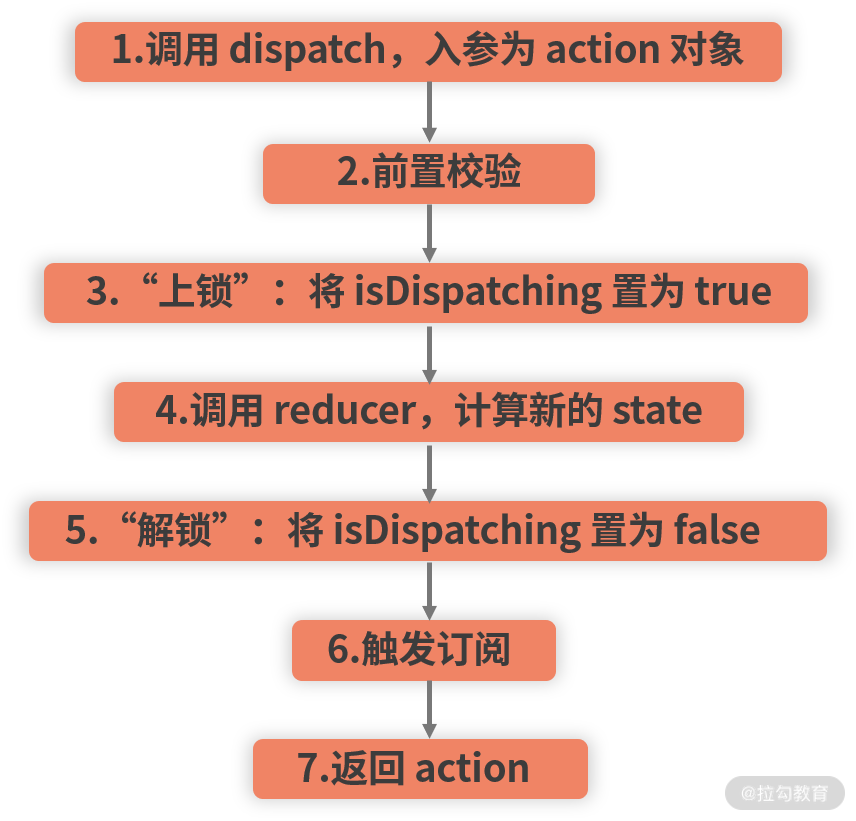

# 19 | 揭秘 Redux 设计思想与工作原理（下）

在上一讲，我们尝试对 Redux 源码进行拆解，认识了 Redux 源码的基本构成与主要模块，并深入了解了 createStore 这个核心模块的工作逻辑。这一讲，我们将更进一步，针对 dispatch 和 subscribe 这两个具体的方法进行分析，分别认识 Redux 工作流中最为核心的**dispatch 动作**，以及 Redux 自身独特的 “发布-订阅”模式。

## Redux 工作流的核心：dispatch 动作

dispatch 应该是大家在使用 Redux 的过程中最为熟悉的 API 了。结合前面对设计思想的解读，我们已经知道，在 Redux 中有这样 3 个关键要素：

* action
* reducer
* store

之所以说 dispatch 是 Redux 工作流的核心，是因为**dispatch 这个动作刚好能把 action、reducer 和 store 这三位“主角”给串联起来**。dispatch 的内部逻辑，足以反映了这三者之间“打配合”的过程。

这里我把 dispatch 的逻辑从 createStore 中给“揪出来”，请看相关源码：

```js
function dispatch(action) {
  // 校验 action 的数据格式是否合法
  if (!isPlainObject(action)) {
    throw new Error(
      'Actions must be plain objects. ' +
      'Use custom middleware for async actions.'
    )
  }
  // 约束 action 中必须有 type 属性作为 action 的唯一标识
  if (typeof action.type === 'undefined') {
    throw new Error(
      'Actions may not have an undefined "type" property. ' +
      'Have you misspelled a constant?'
    )
  }
  // 若当前已经位于 dispatch 的流程中，则不允许再度发起 dispatch（禁止套娃）
  if (isDispatching) {
    throw new Error('Reducers may not dispatch actions.')
  }
  try {
    // 执行 reducer 前，先"上锁"，标记当前已经存在 dispatch 执行流程
    isDispatching = true
    // 调用 reducer，计算新的 state
    currentState = currentReducer(currentState, action)
  } finally {
    // 执行结束后，把"锁"打开，允许再次进行 dispatch
    isDispatching = false
  }
  // 触发订阅
  const listeners = (currentListeners = nextListeners);
  for (let i = 0; i < listeners.length; i++) {
    const listener = listeners[i];
    listener();
  }
  return action;
}
```

这里我结合源码，帮大家将 dispatch 的工作流程提取如下：



在这段工作流中，有两个点值得我们细细回味。

### 1. 通过“上锁”避免“套娃式”的 dispatch

dispatch 工作流中最关键的就是执行 reducer 这一步，它对应的是下面这段代码。

```js
try {
  // 执行 reducer 前，先“上锁”，标记当前已经存在 dispatch 执行流程
  isDispatching = true
  // 调用 reducer，计算新的 state
  currentState = currentReducer(currentState, action)
} finally {
  // 执行结束后，把"锁"打开，允许再次进行 dispatch
  isDispatching = false
}
```

[reducer](./https://www.redux.org.cn/docs/basics/Reducers.html) 的本质是 store 的更新规则，它指定了应用状态的变化如何响应 action 并发送到 store。这段代码中调用 reducer，传入 currentState 和 action，对应的正是第 05 讲中“编码角度看 Redux 工作流”图示中的 action → reducer → store 这个过程，如下图标红处所示：


在调用 reducer 之前，Redux 首先会将 isDispatching 变量置为 true，待 reducer 执行完毕后，再将 isDispatching 变量置为 false。这个操作你应该不陌生，因为在第 11 讲中，setState 的“批处理”也是用类似的“上锁”方式来实现的。

这里之所以要用 isDispatching 将 dispatch 的过程锁起来，目的是规避“套娃式”的 dispatch。更准确地说，是为了避免开发者在 reducer 中手动调用 dispatch。

“禁止套娃”用意何在？首先，从设计的角度来看，**作为一个“计算 state 专用函数”，Redux 在设计 reducer 时就强调了它必须是“纯净”的**，它不应该执行除了计算之外的任何“脏操作”，dispatch 调用显然是一个“脏操作”；其次，从执行的角度来看，若真的在 reducer 中调用 dispatch，那么 dispatch 又会反过来调用 reducer，reducer 又会再次调用 dispatch......这样反复相互调用下去，就会进入死循环，属于非常严重的误操作。

因此，在 dispatch 的前置校验逻辑中，一旦识别出 isDispatching 为 true，就会直接 throw Error（见下面代码），把死循环扼杀在摇篮里：

```js
if (isDispatching) {
  throw new Error('Reducers may not dispatch actions.')
}
```

### 2. 触发订阅的过程

在 reducer 执行完毕后，会进入触发订阅的过程，它对应的是下面这段代码：

```js
// 触发订阅
const listeners = (currentListeners = nextListeners);
for (let i = 0; i < listeners.length; i++) {
  const listener = listeners[i];
  listener();
}
```

在阅读这段源码的过程中，相信你的疑问点主要在两个方面：

1. 第 05 讲我们并没有介绍 subscribe 这个 API，也没有提及 listener 相关的内容，它们到底是如何与 Redux 主流程相结合的呢？
2. 为什么会有 currentListeners 和 nextListeners 这两个 listeners 数组？这和我们平时见到的“发布-订阅”模式好像不太一样。

要弄明白这两个问题，我们需要先了解 subscribe 这个 API。

## Redux 中的“发布-订阅”模式：认识 subscribe

dispatch 中执行的 listeners 数组从订阅中来，而执行订阅需要调用 subscribe。在实际的开发中，subscribe 并不是一个严格必要的方法，**只有在需要监听状态的变化时，我们才会调用 subscribe**。

subscribe 接收一个 Function 类型的 listener 作为入参，它的返回内容恰恰就是这个 listener 对应的解绑函数。你可以通过下面这段示例代码简单把握一下 subscribe 的使用姿势：

```js
function handleChange() {
  // 函数逻辑
}
const unsubscribe = store.subscribe(handleChange)
unsubscribe()
```

subscribe 在订阅时只需要传入监听函数，而不需要传入事件类型。这是因为 Redux 中已经默认了订阅的对象就是“**状态的变化（准确地说是 dispatch 函数的调用）**”这个事件。

到这里，我们就可以回答上面提出的第一个关于 subscribe 的问题了：**subscribe 是如何与 Redux 主流程结合的呢**？首先，我们可以**在 store 对象创建成功后**，通过调用 store.subscribe 来注册监听函数，也可以通过调用 subscribe 的返回函数来解绑监听函数，监听函数是用 listeners 数组来维护的；**当dispatch action 发生时**，Redux 会在 reducer 执行完毕后，将 listeners 数组中的监听函数逐个执行。这就是 subscribe 与 Redux 主流程之间的关系。

接下来我们结合源码来分析一下 subscribe 的内部逻辑，subscribe 源码提取如下：

```js
function subscribe(listener) {
  // 校验 listener 的类型
  if (typeof listener !== 'function') {
    throw new Error('Expected the listener to be a function.')
  }
  // 禁止在 reducer 中调用 subscribe
  if (isDispatching) {
    throw new Error(
      'You may not call store.subscribe() while the reducer is executing. ' +
      'If you would like to be notified after the store has been updated, subscribe from a ' +
      'component and invoke store.getState() in the callback to access the latest state. ' +
      'See https://redux.js.org/api-reference/store#subscribe(listener) for more details.'
    )
  }
  // 该变量用于防止调用多次 unsubscribe 函数
  let isSubscribed = true;
  // 确保 nextListeners 与 currentListeners 不指向同一个引用
  ensureCanMutateNextListeners();
  // 注册监听函数
  nextListeners.push(listener);
  // 返回取消订阅当前 listener 的方法
  return function unsubscribe() {
    if (!isSubscribed) {
      return;
    }
    isSubscribed = false;
    ensureCanMutateNextListeners();
    const index = nextListeners.indexOf(listener);
    // 将当前的 listener 从 nextListeners 数组中删除
    nextListeners.splice(index, 1);
  };
}
```

结合这段源码，我们可以将 subscribe 的工作流程提取如下：


这个工作流中有一个步骤让人很难不在意，那就是对 ensureCanMutateNextListeners 的调用。结合前面整体源码的分析，我们已经知道 ensureCanMutateNextListeners 的作用就是确保 nextListeners 不会和 currentListener 指向同一个引用。 那么为什么要这样做呢？这里就引出了之前提出的关于 subscribe 的第二个问题：**为什么会有 currentListeners 和 nextListeners 两个 listeners 数组**？

要理解这个问题，我们首先要搞清楚 Redux 中的订阅过程和发布过程各自是如何处理 listeners 数组的。

### 1. 订阅过程中的 listeners 数组

两个 listeners 之间的第一次“交锋”发生在 createStore 的变量初始化阶段，nextListeners 会被赋值为 currentListeners（见下面代码），这之后两者确实指向同一个引用。

```js
 let nextListeners = currentListeners
```

但在 subscribe 第一次被调用时，ensureCanMutateNextListeners 就会发现这一点，然后将 nextListeners 纠正为一个内容与 currentListeners 一致、但引用不同的新对象。对应的逻辑如下面代码所示：

```js
function ensureCanMutateNextListeners() {
  // 若两个数组指向同一个引用
  if (nextListeners === currentListeners) {
    // 则将 nextListeners 纠正为一个内容与 currentListeners 一致、但引用不同的新对象
    nextListeners = currentListeners.slice()
  }
}
```

在 subscribe 的逻辑中，ensureCanMutateNextListeners 每次都会在 listener 注册前被无条件调用，用以确保两个数组引用不同。紧跟在 ensureCanMutateNextListeners 之后执行的是 listener 的注册逻辑，我们可以对应源码中看到 listener 最终会被注册到 nextListeners 数组中去：

```js
nextListeners.push(listener);
```

接下来我们来看看事件的发布过程。

### 2. 发布过程中的 listeners 数组

触发订阅这个动作是由 dispatch 来做的，相关的源码如下：

```js
// 触发订阅
const listeners = (currentListeners = nextListeners);
for (let i = 0; i < listeners.length; i++) {
  const listener = listeners[i];
  listener();
}
```

这段源码告诉我们，在触发订阅的过程中，currentListeners 会被赋值为 nextListeners，而实际被执行的 listeners 数组又会被赋值为 currentListeners。因此，**最终被执行的 listeners 数组，实际上和当前的 nextListeners 指向同一个引用**。

这就有点奇妙了：**注册监听也是操作 nextListeners，触发订阅也是读取 nextListeners（实际上，细心的同学会注意到，取消监听操作的也是 nextListeners 数组）。既然如此，要 currentListeners 有何用**？

### 3. currentListeners 数组用于确保监听函数执行过程的稳定性

正因为任何变更都是在 nextListeners 上发生的，我们才需要一个不会被变更的、内容稳定的 currentListeners ，来确保监听函数在执行过程中不会出幺蛾子。

举个例子，下面这种操作在 Redux 中完全是合法的：

```js
// 定义监听函数 A
function listenerA() {
}
// 订阅 A，并获取 A 的解绑函数
const unSubscribeA = store.subscribe(listenerA)
// 定义监听函数 B
function listenerB() {
  // 在 B 中解绑 A
  unSubscribeA()
}
// 定义监听函数 C
function listenerC() {
}
// 订阅 B
store.subscribe(listenerB)
// 订阅 C
store.subscribe(listenerC)
```

在这个 Demo 执行完毕后，nextListeners 数组的内容是 A、B、C 3 个 listener：

```js
[listenerA,  listenerB, listenerC]
```

接下来若调用 dispatch，则会执行下面这段触发订阅的逻辑：

```js
// 触发订阅
const listeners = (currentListeners = nextListeners);
for (let i = 0; i < listeners.length; i++) {
  const listener = listeners[i];
  listener();
}
```

当 for 循环执行到索引 i = 1 处，也就是对应的 listener 为 listenerB 时，问题就会出现：listenerB 中执行了 unSubscribeA 这个动作。而结合我们前面的分析，监听函数注册、解绑、触发这些动作实际影响的都是 nextListeners。为了强化对这一点的认知，我们来复习一下 unsubscribe 的源码：

```js
return function unsubscribe() {
  // 避免多次解绑
  if (!isSubscribed) {
    return;
  }
  isSubscribed = false;
  // 熟悉的操作，调用 ensureCanMutateNextListeners 方法
  ensureCanMutateNextListeners();
  // 获取 listener 在 nextListeners 中的索引
  const index = nextListeners.indexOf(listener);
  // 将当前的 listener 从 nextListeners 数组中删除
  nextListeners.splice(index, 1);
};
```

假如说不存在 currentListeners，那么也就意味着不需要 ensureCanMutateNextListeners 这个动作。若没有 ensureCanMutateNextListeners，unsubscribeA() 执行完之后，listenerA 会同时从 listeners 数组和 nextListeners 数组中消失（因为两者指向的是同一个引用），那么 listeners 数组此时只剩下两个元素 listenerB 和 listenerC，变成这样：

```js
[listenerB, listenerC]
```

listeners 数组的长度改变了，**但 for 循环却不会感知这一点，它将无情地继续循环下去**。之前执行到 `i = 1` 处，`listener = listeners[1]` ，也就是说 `listener === listenerB`；下一步理应执行到 `i = 2` 处，但此时 `listeners[2]` 已经是 undefined 了，原本应该出现在这个索引位上的 listenerC，此时因为数组长度的变化，被前置到了 `i = 1` 处！**这样一来，undefined 就会代替 listenerC 被执行，进而引发函数异常**。

这可怎么办呢？答案当然是**将 nextListeners 与当前正在执行中的 listeners 剥离开来**，将两者指向不同的引用。这也正是 ensureCanMutateNextListeners 所做的事情。

在示例的这种场景下，ensureCanMutateNextListeners 执行前，listeners、currentListeners 和 nextListeners 之间的关系是这样的：

```js
listeners === currentListeners === nextListeners
```

而 ensureCanMutateNextListeners 执行后，nextListeners 就会被剥离出去：

```js
nextListeners = currentListeners.slice()
listeners === currentListeners !== nextListeners
```

这样一来，nextListeners 上的任何改变，都无法再影响正在执行中的 listeners 了。**currentListeners 在此处的作用，就是为了记录下当前正在工作中的 listeners 数组的引用，将它与可能发生改变的 nextListeners 区分开来，以确保监听函数在执行过程中的稳定性**。

## 总结

这两讲，我们对 Redux 的设计思想与实现原理都有了深入的学习。到这里，相信你已经对 Redux 的架构动机、工作原理包括源码的设计依据都有了扎实的掌握。

在 Redux 主流程之外，还有一个不可小觑的厉害角色，那就是**Redux 中间件**。在中间件的加持下，Redux 将化身为一条灵活的“变色龙”，自由地穿梭于不同的需求场景之间。在下一讲，我们就将揭开 Redux 中间件的神秘面纱。
