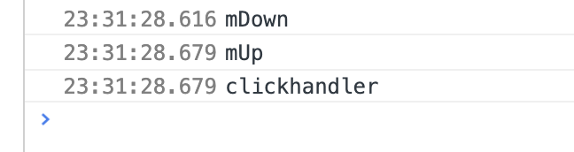

# preventDefault

阻止input失去焦点：

通过document全局代理事件mousedown，判断不是目标input元素时，阻止浏览器默认行为，则input的失去焦点的事件不会触发。

## MouseEvent事件与click事件

通过，触发blur默认行为的是mousedown事件，并不是click事件，click事件的执行顺序也在mousedown，up事件之后。

### mousedown\mouseup\click事件关系

如果用户在一个元素上点击，那么最少三个事件会被触发，事件发生顺序：

1、mousedown,当用户在这个元素上按下鼠标键的时候

2、mouseup，当用户在这个元素上松开鼠标键的时候

3、click，当一个mousedown和一个mouseup都在这个元素上被检测到的时候发生
