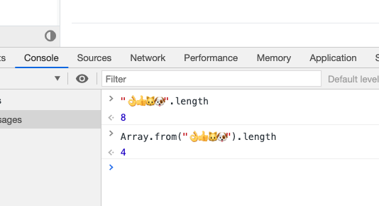
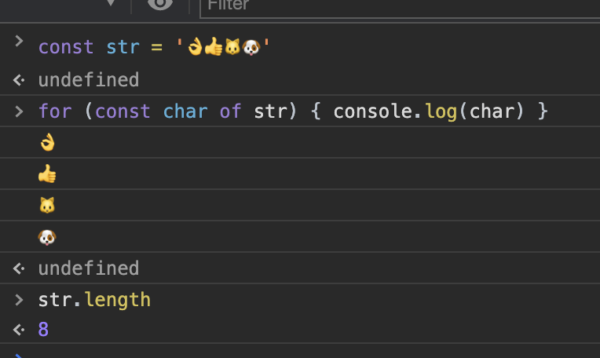

string 的迭代器每次会输出一个 emoji 字符

而 length 表示字节数，并不和迭代器迭代次数严格相等

array.from 是通过传入对象的迭代器来创建数组的

[..."👌👍🐱🐶"]  解构也可以 -> 不过有个新坑 -> babel 会编译成 [].concat("👌👍🐱🐶")
这看起来像是某个transformer的行为
可能是什么trasform spread to concat 之类的

length 表示的是 code unit 的数量(mdn 说的)，UTF16 一个 code unit 应该是 16b，两字节。

👌的unicode 编码是U+1F44C，四字节字符，js使用UTF-16,一般的字符都是2字节,slice 这些方法也都只能对两字节的码点正确处理，为了保持兼容，length属性还是保留原来的行为，所以 '\u{1F44C}'.length 会等于2